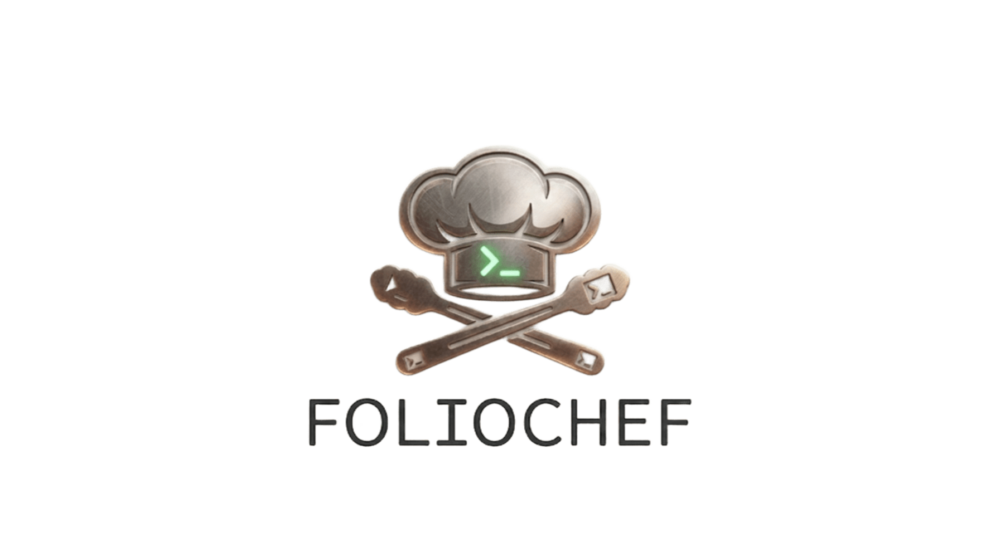

<p align="center">
  
</p>

<h1 align="center">FolioChef</h1>

<p align="center">
  <em>Nấu ăn với các Phụ bếp</em><br/>
  Trình quản lý terminal trên web, được tái hiện như một căn bếp chuyên nghiệp.
</p>

<p align="center">
  
  
  
  
</p>

---

**Bếp trưởng** (bạn) chỉ huy tại pass. Các **Phụ bếp** (AI của bạn) châm lửa terminal, xử lý dữ liệu và giữ mọi station luôn nóng.

## Căn bếp

- **Đa station trên pass** — Mỗi tab terminal là một station. Bật bao nhiêu tuỳ ý.
- **Bếp lửa PTY thật** — Shell process thực, nấu nướng real-time qua WebSocket.
- **Gia vị riêng** — Chọn mood (Spotify Dark, Dracula, Nord, Solarized Dark) hoặc tự pha màu nền.
- **Mise en place** — Cỡ chữ, font chữ — chọn dụng cụ vừa tay cho từng station.
- **Tủ mát** — Tab và lịch sử output được lưu đĩa. Đi đâu quay lại vẫn còn nguyên.
- **Nhóm lửa / Dọn bàn** — Khởi động lại process ì ạch hoặc xoá output không cần đóng station.
- **Order riêng** — Launch station với lệnh và thư mục tuỳ chỉnh.
- **API mở** — Thực đơn REST đầy đủ để quản lý mọi ticket.

## Đội bếp

| Station | Công cụ |
|---------|---------|
| Pass (Frontend) | React 19, Vite, Tailwind CSS, xterm.js, Zustand |
| Bếp (Backend) | Express 5, ws, node-pty |
| Kho (Persistence) | File JSON trên đĩa (`data/`) |
| Vỏ Electron | Electron 35, electron-builder |

---

## Tải về

Tải file `.exe` portable mới nhất từ trang [Releases](https://github.com/anomalyco/cli-for-web-view/releases).

Không cần cài đặt — chỉ cần nhấp đúp `FolioChef.exe` để chạy.

---

## Chạy ứng dụng

### Cách 1 — Ứng dụng desktop (Electron)

> Khuyến nghị. File `.exe` portable, không cần cài Node.js.

1. Tải `FolioChef-x.x.x-portable.exe` từ [Releases](https://github.com/anomalyco/cli-for-web-view/releases).
2. Nhấp đúp để chạy. App tự khởi động server cục bộ và mở cửa sổ riêng.
3. Xong.

### Cách 2 — Trình duyệt web (Phát triển)

> Yêu cầu Node.js >= 18.

```bash
# Clone repo
git clone https://github.com/anomalyco/cli-for-web-view.git
cd cli-for-web-view

# Cài dependencies
npm install
cd client && npm install && cd ..

# Chạy dev servers (server :3001 + Vite :5173)
npm run dev
```

Mở `http://localhost:5173` trên trình duyệt.

### Cách 3 — Build production (Tự host)

> Yêu cầu Node.js >= 18.

```bash
# Build client
npm run build

# Chạy production server
npm start
```

Mở `http://localhost:3001`.

### Build từ nguồn (Electron)

> Yêu cầu Node.js >= 18, npm >= 9, và Visual Studio Build Tools.

```bash
# Cài dependencies
npm install
cd client && npm install && cd ..

# Build client assets
npm run build

# Build file portable exe
npx electron-builder --win portable
```

Output: `release\FolioChef-1.0.0-portable.exe`

---

## Sơ đồ dự án

```
├── client/                    # Pass (React frontend)
│   ├── src/
│   │   ├── components/
│   │   │   ├── Terminal.jsx       # Bếp lửa — xterm.js
│   │   │   ├── Sidebar.jsx        # Danh sách station
│   │   │   ├── SettingsPanel.jsx  # Kệ gia vị
│   │   │   ├── NewTabDialog.jsx   # Mở station mới
│   │   │   └── Footer.jsx         # Trạng thái service
│   │   ├── App.jsx                # Bảng điều khiển bếp trưởng
│   │   ├── store.js               # Vòng quay order
│   │   └── index.css              # Nội quy bếp
│   └── ...
├── server/                    # Bếp (Express + WebSocket)
│   ├── index.js               # Station của bếp trưởng
│   ├── restRouter.js          # Phiếu order (REST)
│   ├── sessionManager.js      # Rotation station
│   ├── ptyManager.js          # Bếp ga (PTY)
│   └── historyStore.js        # Sổ nhật ký
├── electron/                  # Vỏ Electron
│   ├── main.js                # Main process
│   ├── icon.ico               # Icon app
│   └── icon.png               # Icon nguồn
├── data/                      # Tủ mát (dữ liệu runtime)
├── build.bat                  # Script build (CMD)
├── build.ps1                  # Script build (PowerShell)
└── package.json               # Công thức nấu ăn
```

## Thực đơn (API)

| Method | Món | Mô tả |
|--------|-----|-------|
| GET | `/api/tabs` | Danh sách mọi station trên pass |
| POST | `/api/tabs` | Mở station mới |
| DELETE | `/api/tabs/:id` | Đóng station |
| PATCH | `/api/tabs/:id` | Đổi tên hoặc sửa order |
| GET | `/api/history/:id` | Xem nhật ký station |
| DELETE | `/api/history/:id` | Xoá bảng station |
| POST | `/api/tabs/:id/restart` | Nhóm lửa lại |
| WS | `/ws?tabId=&cols=&rows=&command=&cwd=` | Kết nối trực tiếp tới bếp |

---

## Giấy phép

ISC — giờ quay lại pass đi Bếp trưởng.
